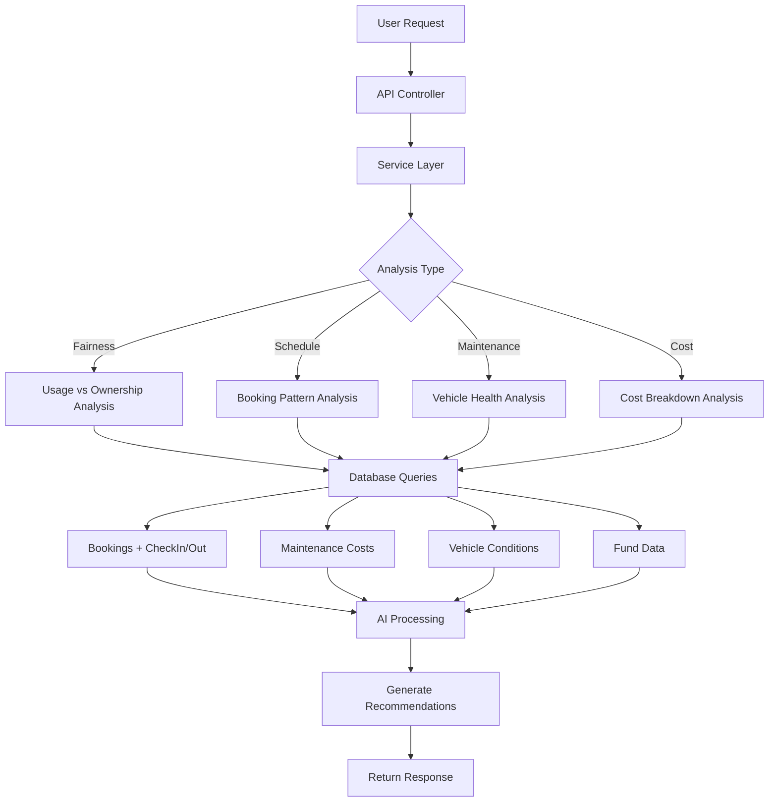

# 🤖 AI-Powered Fairness & Optimization Feature Documentation

## Overview

The **Fairness & Optimization** feature provides intelligent, AI-powered recommendations to help co-owners maximize fairness, minimize costs, and optimize vehicle usage. This comprehensive system combines 4 major capabilities into one cohesive solution:

1. **Fairness Report Generation** - Comprehensive usage vs ownership analysis
2. **Fair Schedule Suggestions** - AI-powered optimal booking recommendations
3. **Predictive Maintenance Suggestions** - Health-based maintenance forecasting
4. **Cost-Saving Recommendations** - Multi-faceted cost optimization advice

## 🎯 Key Features

### 1. **Fairness Report Generation**
Analyzes usage patterns and compares them with ownership percentages to identify imbalances and provide actionable recommendations.

**Key Metrics:**
- Overall Fairness Score (0-100)
- Per co-owner usage vs ownership delta
- Cost allocation recommendations
- Usage pattern classification (Balanced/Overutilized/Underutilized)

### 2. **Fair Schedule Suggestions**
AI-powered scheduling system that suggests optimal booking slots to achieve balanced usage distribution.

**Features:**
- Personalized booking suggestions per co-owner
- Conflict probability analysis
- Peak/off-peak period identification
- Historical pattern-based optimization

### 3. **Predictive Maintenance Suggestions**
Intelligent maintenance recommendations based on vehicle health metrics and usage patterns.

**Capabilities:**
- Battery health monitoring for EVs
- Odometer-based service scheduling
- Predictive cost forecasting (1-6 months)
- Preventive vs reactive maintenance analysis

### 4. **Cost-Saving Recommendations**
Comprehensive cost analysis with actionable savings opportunities.

**Analysis Areas:**
- Maintenance cost optimization
- Fund balance management
- Charging cost optimization
- Usage efficiency improvements

## 📊 Architecture

### File Structure

```
EvCoOwnership.Repositories/
└── DTOs/
    └── FairnessOptimizationDTOs/
        └── FairnessOptimizationDTOs.cs    # 40+ DTOs

EvCoOwnership.Services/
├── Interfaces/
│   └── IFairnessOptimizationService.cs   # 4 method signatures
└── Services/
    └── FairnessOptimizationService.cs     # ~1,400 lines implementation

EvCoOwnership.API/
└── Controllers/
    └── FairnessOptimizationController.cs  # 4 REST endpoints
```

### Data Flow



## 🌐 API Endpoints

### 1. Get Fairness Report
```http
GET /api/fairnessoptimization/vehicle/{vehicleId}/fairness-report
```

**Query Parameters:**
- `startDate` (optional): Analysis start date (defaults to vehicle creation)
- `endDate` (optional): Analysis end date (defaults to current date)
- `includeRecommendations` (optional): Include recommendations (default: true)

**Response Structure:**
```json
{
  "statusCode": 200,
  "message": "FAIRNESS_REPORT_GENERATED_SUCCESSFULLY",
  "data": {
    "vehicleId": 1,
    "vehicleName": "Tesla Model 3",
    "licensePlate": "30A-12345",
    "reportStartDate": "2024-01-01T00:00:00Z",
    "reportEndDate": "2024-10-23T00:00:00Z",
    "overview": {
      "overallFairnessStatus": "Good",
      "fairnessScore": 78.5,
      "averageUsageVariance": 12.3,
      "balancedCoOwnersCount": 1,
      "overutilizedCoOwnersCount": 1,
      "underutilizedCoOwnersCount": 1,
      "mainIssue": "1 co-owner(s) are using vehicle more than ownership share"
    },
    "coOwnersDetails": [
      {
        "coOwnerId": 1,
        "coOwnerName": "John Doe",
        "ownershipPercentage": 40.00,
        "usageHoursPercentage": 55.50,
        "usageDistancePercentage": 52.00,
        "usageBookingsPercentage": 60.00,
        "averageUsagePercentage": 55.83,
        "usageVsOwnershipDelta": 15.83,
        "usagePattern": "Overutilized",
        "fairnessScore": 70,
        "expectedCostShare": 4000000,
        "actualCostShare": 5583000,
        "costAdjustmentNeeded": 1583000,
        "recommendations": [
          "Consider reducing usage by 15.8% to match ownership share",
          "Additional cost contribution of 1,583,000 VND may be fair"
        ]
      }
    ],
    "recommendations": [
      {
        "type": "Usage",
        "priority": "High",
        "title": "Rebalance Usage Distribution",
        "description": "1 co-owner(s) are overutilizing while 1 are underutilizing",
        "actionItems": [
          "Schedule group meeting to discuss fair usage",
          "Implement booking rotation system",
          "Consider adjusting ownership percentages if pattern persists"
        ],
        "expectedImpact": 12.3,
        "affectedCoOwnerIds": [1, 2]
      },
      {
        "type": "Cost",
        "priority": "High",
        "title": "Adjust Cost Sharing Based on Actual Usage",
        "description": "Cost allocation mismatches detected for 2 co-owner(s)",
        "actionItems": [
          "Review maintenance cost distribution",
          "Implement usage-based cost allocation",
          "Set up monthly cost reconciliation"
        ],
        "expectedImpact": 3166000,
        "affectedCoOwnerIds": [1, 2]
      }
    ],
    "metrics": {
      "totalUsageHours": 400.0,
      "totalUsageDistance": 12000,
      "totalBookings": 25,
      "totalMaintenanceCost": 10000000,
      "totalFundBalance": 5000000,
      "usageVariance": 12.3,
      "optimalRebalanceFrequencyDays": 30
    }
  }
}
```

### 2. Get Fair Schedule Suggestions
```http
GET /api/fairnessoptimization/vehicle/{vehicleId}/schedule-suggestions
```

**Query Parameters:**
- `startDate` (required): Schedule period start date (must be in future)
- `endDate` (required): Schedule period end date
- `preferredDurationHours` (optional): Preferred booking duration (default: 4)
- `usageType` (optional): Maintenance, Insurance, Fuel, Parking, Other

**Response Structure:**
```json
{
  "statusCode": 200,
  "message": "SCHEDULE_SUGGESTIONS_GENERATED_SUCCESSFULLY",
  "data": {
    "vehicleId": 1,
    "vehicleName": "Tesla Model 3",
    "suggestionPeriodStart": "2024-11-01T00:00:00Z",
    "suggestionPeriodEnd": "2024-11-30T00:00:00Z",
    "coOwnerSuggestions": [
      {
        "coOwnerId": 1,
        "coOwnerName": "John Doe",
        "ownershipPercentage": 40.00,
        "currentUsagePercentage": 25.00,
        "recommendedUsagePercentage": 40.00,
        "suggestedBookingsCount": 5,
        "suggestedTotalHours": 20.0,
        "suggestedSlots": [
          {
            "startTime": "2024-11-05T08:00:00Z",
            "endTime": "2024-11-05T12:00:00Z",
            "durationHours": 4.0,
            "reason": "Optimal morning slot on Tuesday for maintenance",
            "conflictProbability": 0.15,
            "benefits": [
              "Low conflict risk",
              "Balanced usage distribution",
              "Optimal time slot based on historical data"
            ]
          },
          {
            "startTime": "2024-11-12T10:00:00Z",
            "endTime": "2024-11-12T14:00:00Z",
            "durationHours": 4.0,
            "reason": "Optimal morning slot on Tuesday for maintenance",
            "conflictProbability": 0.20,
            "benefits": [
              "Low conflict risk",
              "Balanced usage distribution"
            ]
          }
        ],
        "rationale": "You're currently underutilizing by 15.0%. Suggested bookings will help you use your fair share."
      }
    ],
    "optimalTimeSlots": [
      {
        "dayOfWeek": "Tuesday",
        "startTime": "06:00:00",
        "endTime": "12:00:00",
        "utilizationRate": 20.5,
        "peakType": "Low",
        "recommendedForCoOwnerIds": [1, 2, 3]
      },
      {
        "dayOfWeek": "Thursday",
        "startTime": "12:00:00",
        "endTime": "18:00:00",
        "utilizationRate": 25.3,
        "peakType": "Medium",
        "recommendedForCoOwnerIds": [1, 2]
      }
    ],
    "insights": {
      "currentUtilizationRate": 35.2,
      "optimalUtilizationRate": 40.0,
      "conflictingBookingsCount": 3,
      "peakUsagePeriods": ["Weekends", "Weekday evenings"],
      "underutilizedPeriods": ["Weekday mornings", "Tuesday-Thursday afternoons"],
      "potentialEfficiencyGain": 4.8
    }
  }
}
```

### 3. Get Maintenance Suggestions
```http
GET /api/fairnessoptimization/vehicle/{vehicleId}/maintenance-suggestions
```

**Query Parameters:**
- `includePredictive` (optional): Include AI-based predictions (default: true)
- `lookaheadDays` (optional): Forecast period in days (default: 30, max: 365)

**Response Structure:**
```json
{
  "statusCode": 200,
  "message": "MAINTENANCE_SUGGESTIONS_GENERATED_SUCCESSFULLY",
  "data": {
    "vehicleId": 1,
    "vehicleName": "Tesla Model 3",
    "licensePlate": "30A-12345",
    "healthStatus": {
      "currentOdometer": 45000,
      "averageDailyDistance": 65.5,
      "daysSinceLastMaintenance": 125,
      "distanceSinceLastMaintenance": 8200,
      "overallHealth": "Good",
      "healthScore": 82,
      "healthIssues": []
    },
    "suggestions": [
      {
        "maintenanceType": "Routine",
        "title": "Battery Health Check",
        "description": "Regular battery inspection recommended for optimal EV performance",
        "urgency": "Medium",
        "reason": "125 days since last maintenance",
        "recommendedDate": "2024-10-30T00:00:00Z",
        "daysUntilRecommended": 7,
        "estimatedCost": 500000,
        "costSavingIfDoneNow": 200000,
        "consequences": [
          "Reduced battery life if neglected",
          "Potential range reduction",
          "Higher costs for emergency repairs"
        ],
        "benefits": [
          "Extended battery lifespan",
          "Maintained vehicle range",
          "Early detection of issues"
        ]
      },
      {
        "maintenanceType": "Routine",
        "title": "Tire Rotation and Inspection",
        "description": "Tire rotation recommended every 8,000-10,000 km",
        "urgency": "Medium",
        "reason": "8200 km since last service",
        "recommendedOdometerReading": 47000,
        "recommendedDate": "2024-11-06T00:00:00Z",
        "daysUntilRecommended": 14,
        "estimatedCost": 800000,
        "costSavingIfDoneNow": 300000,
        "consequences": [
          "Uneven tire wear",
          "Reduced safety and handling",
          "Need for premature tire replacement"
        ],
        "benefits": [
          "Extended tire life",
          "Improved safety",
          "Better fuel efficiency"
        ]
      },
      {
        "maintenanceType": "Routine",
        "title": "Annual Vehicle Inspection",
        "description": "Mandatory annual safety and emissions inspection",
        "urgency": "High",
        "reason": "Required by law annually",
        "recommendedDate": "2024-11-23T00:00:00Z",
        "daysUntilRecommended": 30,
        "estimatedCost": 1500000,
        "costSavingIfDoneNow": 0,
        "consequences": [
          "Legal penalties if overdue",
          "Insurance issues",
          "Cannot legally operate vehicle"
        ],
        "benefits": [
          "Legal compliance",
          "Safety assurance",
          "Valid insurance coverage"
        ]
      }
    ],
    "upcomingMaintenance": [
      {
        "maintenanceType": "Routine",
        "dueDate": "2024-11-23T00:00:00Z",
        "daysUntilDue": 30,
        "odometerDue": 50000,
        "estimatedCost": 2000000,
        "isOverdue": false
      }
    ],
    "costForecast": {
      "forecastPeriodDays": 30,
      "estimatedTotalCost": 2800000,
      "averageMonthlyCost": 2800000,
      "costPerCoOwnerAverage": 1400000,
      "monthlyForecasts": [
        {
          "month": "Nov 2024",
          "estimatedCost": 2800000,
          "expectedMaintenanceTypes": ["Routine", "Routine", "Routine"]
        }
      ],
      "costDrivers": [
        "Regular scheduled maintenance",
        "Battery health checks",
        "Tire maintenance"
      ]
    }
  }
}
```

### 4. Get Cost-Saving Recommendations
```http
GET /api/fairnessoptimization/vehicle/{vehicleId}/cost-saving-recommendations
```

**Query Parameters:**
- `analysisPeriodDays` (optional): Analysis period (default: 90, min: 7, max: 365)
- `includeFundOptimization` (optional): Include fund recommendations (default: true)
- `includeMaintenanceOptimization` (optional): Include maintenance recommendations (default: true)

**Response Structure:**
```json
{
  "statusCode": 200,
  "message": "COST_SAVING_RECOMMENDATIONS_GENERATED_SUCCESSFULLY",
  "data": {
    "vehicleId": 1,
    "vehicleName": "Tesla Model 3",
    "summary": {
      "analysisPeriodDays": 90,
      "totalCostsIncurred": 15000000,
      "averageMonthlyCost": 5000000,
      "costPerKm": 125,
      "costPerBooking": 500000,
      "potentialSavings": 4500000,
      "savingsPercentage": 30.0,
      "costBreakdowns": [
        {
          "category": "Routine",
          "amount": 10000000,
          "percentage": 66.7,
          "trend": "Stable"
        },
        {
          "category": "Repair",
          "amount": 5000000,
          "percentage": 33.3,
          "trend": "Increasing"
        }
      ]
    },
    "recommendations": [
      {
        "category": "Maintenance",
        "priority": "High",
        "title": "Switch to Preventive Maintenance Schedule",
        "description": "Regular preventive maintenance costs less than reactive repairs",
        "potentialSavingsAmount": 3000000,
        "potentialSavingsPercentage": 30.0,
        "timeframeForSavings": "6-12 months",
        "actionSteps": [
          "Create maintenance schedule based on odometer readings",
          "Book services during off-peak times for discounts",
          "Establish relationship with preferred service provider",
          "Keep detailed maintenance records"
        ],
        "difficulty": "Easy",
        "implementationCost": 0,
        "roi": 300.0
      },
      {
        "category": "Fund",
        "priority": "High",
        "title": "Increase Fund Balance to Avoid Emergency Expenses",
        "description": "Low fund balance may lead to unexpected individual payments",
        "potentialSavingsAmount": 0,
        "potentialSavingsPercentage": 0,
        "timeframeForSavings": "1-3 months",
        "actionSteps": [
          "Set up automatic monthly contributions",
          "Target 3-month expense buffer",
          "Review and adjust contribution amounts",
          "Notify co-owners of funding needs"
        ],
        "difficulty": "Medium",
        "implementationCost": 7000000,
        "roi": 0
      },
      {
        "category": "General",
        "priority": "Medium",
        "title": "Optimize Charging Costs",
        "description": "Charge during off-peak hours to reduce electricity costs",
        "potentialSavingsAmount": 750000,
        "potentialSavingsPercentage": 15.0,
        "timeframeForSavings": "Ongoing",
        "actionSteps": [
          "Use time-of-use electricity rates",
          "Schedule charging for overnight (off-peak)",
          "Install home charging station for lower rates",
          "Track charging costs per co-owner"
        ],
        "difficulty": "Easy",
        "implementationCost": 0,
        "roi": 150.0
      }
    ],
    "fundInsights": {
      "currentFundBalance": 8000000,
      "recommendedMinimumBalance": 10000000,
      "recommendedOptimalBalance": 15000000,
      "isUnderfunded": true,
      "isOverfunded": false,
      "averageMonthlyExpenses": 5000000,
      "monthsCovered": 1,
      "fundHealthIssues": [
        "Fund balance below recommended minimum",
        "Insufficient buffer for unexpected expenses"
      ],
      "fundOptimizationTips": [
        "Maintain 2-3 months of expenses as buffer",
        "Set up automatic contributions from all co-owners",
        "Review fund quarterly and adjust as needed"
      ]
    },
    "maintenanceInsights": {
      "averageMaintenanceCost": 2500000,
      "preventiveMaintenanceRatio": 40.0,
      "reactiveMaintenanceRatio": 60.0,
      "potentialSavingsFromPreventive": 2000000,
      "highCostMaintenanceTypes": ["Repair", "Emergency", "Routine"],
      "hasMaintenanceSchedule": false,
      "optimizationOpportunities": [
        "Increase preventive maintenance ratio to reduce costs",
        "Establish regular maintenance schedule",
        "Monitor high-cost maintenance types closely"
      ]
    }
  }
}
```

## 🧮 Calculation Logic

### Fairness Score Calculation
```csharp
FairnessScore = 100 - (UsageVsOwnershipDelta * ScaleFactor)

Where:
- Delta ≤ 5%:  Score = 100 (Excellent)
- Delta ≤ 10%: Score = 85  (Good)
- Delta ≤ 15%: Score = 70  (Fair)
- Delta ≤ 20%: Score = 55  (Poor)
- Delta > 20%: Score = 40 or less (Critical)
```

### Usage Pattern Classification
```csharp
Pattern Classification:
- Balanced:      |Delta| ≤ 5%
- Overutilized:  Delta > 5%
- Underutilized: Delta < -5%

Where Delta = AverageUsagePercentage - OwnershipPercentage
```

### Cost Adjustment Calculation
```csharp
ExpectedCostShare = TotalCost × (OwnershipPercentage / 100)
ActualCostShare = TotalCost × (AverageUsagePercentage / 100)
CostAdjustmentNeeded = ActualCostShare - ExpectedCostShare
```

### Schedule Conflict Probability
```csharp
ConflictProbability = SimilarBookingsCount / TotalSimilarPeriods

Where:
- SimilarBookings: Same day of week, ±2 hours time window
- LowRisk:    Probability < 0.3
- MediumRisk: Probability 0.3 - 0.6
- HighRisk:   Probability > 0.6
```

### Vehicle Health Score
```csharp
BaseScore = 100
- Deduct 20 points if no maintenance > 6 months
- Deduct 15 points if distance > 10,000 km since last service
- Deduct 10 points per health issue detected

HealthStatus = Score >= 90 ? "Excellent"
             : Score >= 75 ? "Good"
             : Score >= 60 ? "Fair"
             : "Poor"
```

### Fund Optimization Thresholds
```csharp
RecommendedMinimum = AverageMonthlyExpense × 2
RecommendedOptimal = AverageMonthlyExpense × 3

IsUnderfunded = CurrentBalance < RecommendedMinimum
IsOverfunded  = CurrentBalance > RecommendedOptimal × 2
```

## 📈 Use Cases

### Use Case 1: Identifying Usage Imbalance
**Scenario**: One co-owner suspects unfair usage distribution

```javascript
// Step 1: Generate fairness report
GET /api/fairnessoptimization/vehicle/1/fairness-report
    ?startDate=2024-01-01&endDate=2024-10-23

// Step 2: Review fairness score and co-owner details
// - Overall score: 70 (Fair)
// - John: 40% ownership, 55.8% usage (Overutilized +15.8%)
// - Jane: 60% ownership, 44.2% usage (Underutilized -15.8%)

// Step 3: Follow recommendations
// - Schedule meeting to discuss usage patterns
// - Implement booking rotation
// - Adjust cost sharing: John pays extra 1,583,000 VND
```

### Use Case 2: Planning Fair Future Bookings
**Scenario**: Co-owners want to plan next month fairly

```javascript
// Step 1: Get schedule suggestions
GET /api/fairnessoptimization/vehicle/1/schedule-suggestions
    ?startDate=2024-11-01&endDate=2024-11-30
    &preferredDurationHours=4

// Step 2: Review personalized suggestions
// - John (40% ownership, 25% current usage):
//   → 5 suggested bookings (20 hours total)
//   → Low-conflict Tuesday mornings
//   → Rationale: "Underutilizing by 15%, increase usage"

// Step 3: Book suggested slots
// - Low conflict probability (15-20%)
// - Optimal times based on historical data
// - Achieves balanced usage distribution
```

### Use Case 3: Preventive Maintenance Planning
**Scenario**: Plan maintenance to avoid breakdowns

```javascript
// Step 1: Get maintenance suggestions
GET /api/fairnessoptimization/vehicle/1/maintenance-suggestions
    ?includePredictive=true&lookaheadDays=60

// Step 2: Review health status
// - Current odometer: 45,000 km
// - Health score: 82/100 (Good)
// - 125 days since last service

// Step 3: Schedule recommended maintenance
// Priority 1 (High): Annual inspection (30 days)
// Priority 2 (Medium): Tire rotation (14 days)
// Priority 3 (Medium): Battery check (7 days)

// Step 4: Budget for costs
// - Total forecast (60 days): 2,800,000 VND
// - Per co-owner: 1,400,000 VND
// - Preventive savings: 500,000 VND
```

### Use Case 4: Reducing Monthly Costs
**Scenario**: Co-owners want to reduce expenses

```javascript
// Step 1: Analyze costs
GET /api/fairnessoptimization/vehicle/1/cost-saving-recommendations
    ?analysisPeriodDays=90

// Step 2: Review cost analysis
// - Total costs (90 days): 15,000,000 VND
// - Breakdown: 66.7% routine, 33.3% reactive
// - Potential savings: 4,500,000 VND (30%)

// Step 3: Implement high-priority recommendations
// 1. Switch to preventive schedule (saves 3,000,000 VND)
// 2. Optimize charging costs (saves 750,000 VND)
// 3. Increase fund balance (avoid emergency costs)

// Step 4: Track improvements
// - Target: 40% preventive ratio → saves 2,000,000 VND
// - Establish maintenance schedule
// - Monitor costs monthly
```

## 🚀 Integration Guide

### React Component Example
```jsx
import React, { useState, useEffect } from 'react';
import { Chart } from 'chart.js';

function FairnessOverview({ vehicleId }) {
  const [report, setReport] = useState(null);
  const [suggestions, setSuggestions] = useState(null);

  useEffect(() => {
    // Fetch fairness report
    fetch(`/api/fairnessoptimization/vehicle/${vehicleId}/fairness-report`)
      .then(res => res.json())
      .then(data => setReport(data.data));

    // Fetch maintenance suggestions
    fetch(`/api/fairnessoptimization/vehicle/${vehicleId}/maintenance-suggestions`)
      .then(res => res.json())
      .then(data => setSuggestions(data.data));
  }, [vehicleId]);

  if (!report) return <Loading />;

  return (
    <div className="fairness-dashboard">
      {/* Fairness Score Card */}
      <ScoreCard
        title="Fairness Score"
        score={report.overview.fairnessScore}
        status={report.overview.overallFairnessStatus}
        color={getScoreColor(report.overview.fairnessScore)}
      />

      {/* Co-Owners Comparison Chart */}
      <BarChart
        data={report.coOwnersDetails.map(co => ({
          name: co.coOwnerName,
          ownership: co.ownershipPercentage,
          usage: co.averageUsagePercentage
        }))}
      />

      {/* Recommendations List */}
      <RecommendationsList
        recommendations={report.recommendations}
        onActionClick={handleRecommendation}
      />

      {/* Maintenance Alerts */}
      {suggestions?.suggestions.filter(s => s.urgency === 'High').map(alert => (
        <Alert
          key={alert.title}
          type="warning"
          title={alert.title}
          description={alert.description}
          actions={alert.benefits}
        />
      ))}
    </div>
  );
}

function getScoreColor(score) {
  if (score >= 90) return '#2ecc71'; // Green
  if (score >= 75) return '#3498db'; // Blue
  if (score >= 60) return '#f39c12'; // Orange
  return '#e74c3c'; // Red
}
```

### Chart.js Visualization
```javascript
// Fairness comparison chart
function createFairnessChart(coOwnersData) {
  const ctx = document.getElementById('fairnessChart');
  
  new Chart(ctx, {
    type: 'bar',
    data: {
      labels: coOwnersData.map(co => co.coOwnerName),
      datasets: [
        {
          label: 'Ownership %',
          data: coOwnersData.map(co => co.ownershipPercentage),
          backgroundColor: '#3498db'
        },
        {
          label: 'Usage %',
          data: coOwnersData.map(co => co.averageUsagePercentage),
          backgroundColor: coOwnersData.map(co => 
            co.usagePattern === 'Balanced' ? '#2ecc71' :
            co.usagePattern === 'Overutilized' ? '#e74c3c' : '#f39c12'
          )
        }
      ]
    },
    options: {
      responsive: true,
      plugins: {
        title: {
          display: true,
          text: 'Usage vs Ownership Comparison'
        },
        tooltip: {
          callbacks: {
            afterLabel: (context) => {
              const index = context.dataIndex;
              const co = coOwnersData[index];
              return `Pattern: ${co.usagePattern}\nDelta: ${co.usageVsOwnershipDelta.toFixed(1)}%`;
            }
          }
        }
      },
      scales: {
        y: {
          beginAtZero: true,
          max: 100,
          title: { display: true, text: 'Percentage (%)' }
        }
      }
    }
  });
}
```

## 🔐 Authorization

All endpoints require:
- **Authentication**: Bearer JWT token
- **Role**: CoOwner
- **Ownership Verification**: User must be active co-owner of vehicle

**Error Responses:**
- `403 NOT_AUTHORIZED_TO_VIEW_VEHICLE_FAIRNESS_REPORT`
- `403 NOT_AUTHORIZED_TO_VIEW_SCHEDULE_SUGGESTIONS`
- `403 NOT_AUTHORIZED_TO_VIEW_MAINTENANCE_SUGGESTIONS`
- `403 NOT_AUTHORIZED_TO_VIEW_COST_RECOMMENDATIONS`
- `404 VEHICLE_NOT_FOUND`

## 📊 Performance Considerations

### Query Optimization
- **Eager Loading**: Uses `Include()` for related entities (Bookings, CheckIns, CheckOuts, MaintenanceCosts, VehicleConditions)
- **Selective Queries**: Only loads active co-owners and relevant date ranges
- **Efficient Aggregations**: Uses LINQ Sum/Average for calculations

### Caching Strategy
```csharp
// Recommended caching durations
[ResponseCache(Duration = 600)]  // Fairness Report: 10 minutes
[ResponseCache(Duration = 900)]  // Schedule Suggestions: 15 minutes
[ResponseCache(Duration = 1800)] // Maintenance: 30 minutes
[ResponseCache(Duration = 3600)] // Cost Recommendations: 1 hour
```

### Large Datasets
- **Pagination**: Not needed (limited by vehicle co-owners count, typically < 10)
- **Date Filtering**: Always use date ranges to limit booking queries
- **Aggregation First**: Calculate totals before detailed processing

## ✅ Best Practices

### For Co-Owners
1. **Regular Monitoring**: Check fairness report monthly
2. **Act on Recommendations**: Implement high-priority suggestions
3. **Communicate**: Discuss imbalances with other co-owners
4. **Plan Ahead**: Use schedule suggestions for next month
5. **Preventive Maintenance**: Follow maintenance calendar

### For Developers
1. **Validate Inputs**: Use FluentValidation for request parameters
2. **Error Handling**: Return appropriate status codes and messages
3. **Authorization**: Always verify co-owner access
4. **Logging**: Log analysis requests and recommendation generation
5. **Testing**: Unit test calculation logic thoroughly

### For System Administrators
1. **Monitor API Usage**: Track endpoint call frequency
2. **Database Indices**: Ensure proper indexing on Booking.StartTime, MaintenanceCost.CreatedAt
3. **Cache Configuration**: Adjust cache durations based on usage patterns
4. **Alert Thresholds**: Set up alerts for low fund balances, overdue maintenance

## 🚀 Future Enhancements

1. **Machine Learning Integration**
   - Predictive models for maintenance failure rates
   - Usage pattern anomaly detection
   - Cost forecasting with seasonal trends

2. **Advanced Scheduling**
   - Auto-booking based on fairness gaps
   - Smart conflict resolution
   - Integration with calendar apps

3. **Real-time Alerts**
   - Push notifications for fairness imbalances
   - Urgent maintenance reminders
   - Cost threshold warnings

4. **Custom Metrics**
   - User-defined fairness thresholds
   - Custom cost allocation formulas
   - Personalized recommendation weights

5. **Export & Reporting**
   - PDF report generation
   - Excel export for detailed analysis
   - Scheduled email reports

6. **Integration APIs**
   - Connect with accounting systems
   - Vehicle telematics integration
   - Service provider APIs for maintenance booking

## 📚 Related Documentation

- [USAGE_ANALYTICS_FEATURE.md](./USAGE_ANALYTICS_FEATURE.md) - Usage vs ownership comparison
- [OWNERSHIP_CHANGE_FEATURE.md](./OWNERSHIP_CHANGE_FEATURE.md) - Ownership adjustments
- [OWNERSHIP_HISTORY_FEATURE.md](./OWNERSHIP_HISTORY_FEATURE.md) - Historical tracking
- [README_coding_conventions.md](./EvCoOwnership.API/README_coding_conventions.md) - Code standards

---

**Created**: October 23, 2024  
**Last Updated**: October 23, 2024  
**Version**: 1.0.0  
**Status**: ✅ Production Ready
