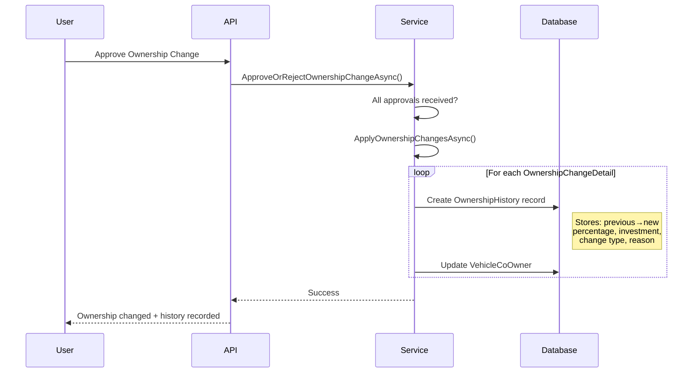

# 📊 Ownership History Feature Documentation

## Overview

The **Ownership History** feature provides comprehensive audit trail and historical tracking capabilities for vehicle ownership changes in the EV Co-Ownership system. It automatically records all ownership modifications and provides various query endpoints to view the evolution of ownership over time.

## 🎯 Key Features

1. **Automatic History Recording** - Every approved ownership change is automatically logged
2. **Timeline View** - See how ownership evolved over time for all co-owners
3. **Historical Snapshots** - Reconstruct ownership distribution at any past date
4. **Statistics & Analytics** - Get aggregated metrics about ownership changes
5. **Personal History** - Track individual co-owner's ownership across all vehicles
6. **Comprehensive Filtering** - Filter history by date range, change type, or specific co-owner

## 🗂️ Architecture

### Database Schema

#### `ownership_history` Table
```sql
CREATE TABLE ownership_history (
    id                              SERIAL PRIMARY KEY,
    vehicle_id                      INTEGER NOT NULL REFERENCES vehicles(id) ON DELETE CASCADE,
    co_owner_id                     INTEGER NOT NULL REFERENCES co_owners(user_id) ON DELETE CASCADE,
    user_id                         INTEGER NOT NULL REFERENCES users(id) ON DELETE CASCADE,
    ownership_change_request_id     INTEGER REFERENCES ownership_change_requests(id) ON DELETE SET NULL,
    
    -- Previous State
    previous_percentage             NUMERIC(5,2) NOT NULL,
    previous_investment             NUMERIC(15,2) NOT NULL,
    
    -- New State
    new_percentage                  NUMERIC(5,2) NOT NULL,
    new_investment                  NUMERIC(15,2) NOT NULL,
    
    -- Calculated Changes
    percentage_change               NUMERIC(5,2) NOT NULL,
    investment_change               NUMERIC(15,2) NOT NULL,
    
    -- Metadata
    change_type_enum                INTEGER NOT NULL,  -- EOwnershipChangeType
    reason                          VARCHAR(1000),
    changed_by_user_id              INTEGER NOT NULL REFERENCES users(id) ON DELETE CASCADE,
    created_at                      TIMESTAMP NOT NULL DEFAULT NOW()
);

-- Indexes for performance
CREATE INDEX idx_ownership_history_vehicle_id ON ownership_history(vehicle_id);
CREATE INDEX idx_ownership_history_co_owner_id ON ownership_history(co_owner_id);
CREATE INDEX idx_ownership_history_user_id ON ownership_history(user_id);
CREATE INDEX idx_ownership_history_created_at ON ownership_history(created_at);
```

### Change Types (EOwnershipChangeType)

| Value | Type | Description |
|-------|------|-------------|
| 0 | Initial | Initial ownership assignment when vehicle is created |
| 1 | Adjustment | Ownership percentage adjustment among existing co-owners |
| 2 | Transfer | Ownership transferred from one co-owner to another |
| 3 | Exit | Co-owner exits and ownership redistributed |
| 4 | NewMember | New co-owner joins and ownership redistributed |
| 5 | AdminAdjustment | Administrative adjustment by system admin |

## 📁 File Structure

```
EvCoOwnership.Repositories/
├── Models/
│   └── OwnershipHistoryModels.cs              # OwnershipHistory entity
├── Enums/
│   └── EOwnershipChangeType.cs                # Change type enum
├── DTOs/
│   └── OwnershipDTOs/
│       └── OwnershipHistoryDTOs.cs            # 7 DTOs for history views
└── Context/
    └── EvCoOwnershipDbContext.cs              # Added OwnershipHistory DbSet + config

EvCoOwnership.Services/
├── Interfaces/
│   └── IOwnershipChangeService.cs             # Added 5 history methods
└── Services/
    └── OwnershipChangeService.cs              # Implemented history tracking + queries

EvCoOwnership.API/
└── Controllers/
    └── OwnershipHistoryController.cs          # 5 REST endpoints
```

## 🔄 How It Works

### Automatic Recording Flow



### History Creation Logic

When `ApplyOwnershipChangesAsync` is called (after all approvals received):

```csharp
foreach (var detail in ownershipChangeDetails)
{
    // Create history record
    var historyRecord = new OwnershipHistory
    {
        VehicleId = changeRequest.VehicleId,
        CoOwnerId = detail.CoOwnerId,
        UserId = detail.CoOwner.UserId,
        OwnershipChangeRequestId = changeRequest.Id,
        
        // Before state
        PreviousPercentage = detail.CurrentPercentage,
        PreviousInvestment = detail.CurrentInvestment,
        
        // After state
        NewPercentage = detail.ProposedPercentage,
        NewInvestment = detail.ProposedInvestment,
        
        // Calculated changes
        PercentageChange = detail.ProposedPercentage - detail.CurrentPercentage,
        InvestmentChange = detail.ProposedInvestment - detail.CurrentInvestment,
        
        // Metadata
        ChangeTypeEnum = EOwnershipChangeType.Adjustment,
        Reason = changeRequest.Reason,
        ChangedByUserId = changeRequest.ProposedByUserId,
        CreatedAt = DateTime.UtcNow
    };
    
    _unitOfWork.DbContext.Set<OwnershipHistory>().Add(historyRecord);
    
    // Update actual ownership
    vehicleCoOwner.OwnershipPercentage = detail.ProposedPercentage;
    vehicleCoOwner.InvestmentAmount = detail.ProposedInvestment;
}

await _unitOfWork.SaveChangesAsync();
```

## 🌐 API Endpoints

### 1. Get Vehicle Ownership History (Filtered)
```http
GET /api/ownershiphistory/vehicle/{vehicleId}
```

**Query Parameters:**
- `changeType` (optional): Filter by type (Initial/Adjustment/Transfer/Exit/NewMember/AdminAdjustment)
- `startDate` (optional): Filter by start date (ISO 8601)
- `endDate` (optional): Filter by end date (ISO 8601)
- `coOwnerId` (optional): Filter by specific co-owner
- `offset` (optional): Pagination offset (default: 0)
- `limit` (optional): Pagination limit (default: 50)

**Response:**
```json
{
  "statusCode": 200,
  "message": "FOUND_3_OWNERSHIP_HISTORY_RECORDS",
  "data": [
    {
      "id": 1,
      "vehicleId": 1,
      "vehicleName": "Tesla Model 3",
      "licensePlate": "30A-12345",
      "coOwnerId": 1,
      "userId": 5,
      "coOwnerName": "John Doe",
      "email": "john@example.com",
      "ownershipChangeRequestId": 1,
      "previousPercentage": 40.00,
      "newPercentage": 45.00,
      "percentageChange": 5.00,
      "previousInvestment": 400000000.00,
      "newInvestment": 450000000.00,
      "investmentChange": 50000000.00,
      "changeType": "Adjustment",
      "reason": "Increased investment contribution",
      "changedByUserId": 5,
      "changedByName": "John Doe",
      "createdAt": "2024-01-15T10:30:00Z"
    }
  ],
  "additionalData": {
    "totalCount": 3,
    "offset": 0,
    "limit": 50
  }
}
```

### 2. Get Vehicle Ownership Timeline
```http
GET /api/ownershiphistory/vehicle/{vehicleId}/timeline
```

Shows complete ownership evolution for all co-owners over time.

**Response:**
```json
{
  "statusCode": 200,
  "message": "VEHICLE_OWNERSHIP_TIMELINE_RETRIEVED_SUCCESSFULLY",
  "data": {
    "vehicleId": 1,
    "vehicleName": "Tesla Model 3",
    "licensePlate": "30A-12345",
    "vehicleCreatedAt": "2023-06-01T08:00:00Z",
    "totalHistoryRecords": 5,
    "coOwnersTimeline": [
      {
        "coOwnerId": 1,
        "userId": 5,
        "coOwnerName": "John Doe",
        "email": "john@example.com",
        "currentPercentage": 45.00,
        "initialPercentage": 40.00,
        "totalChange": 5.00,
        "joinedAt": "2023-06-01T08:00:00Z",
        "changeCount": 2,
        "changes": [...]
      },
      {
        "coOwnerId": 2,
        "userId": 6,
        "coOwnerName": "Jane Smith",
        "email": "jane@example.com",
        "currentPercentage": 55.00,
        "initialPercentage": 60.00,
        "totalChange": -5.00,
        "joinedAt": "2023-06-01T08:00:00Z",
        "changeCount": 2,
        "changes": [...]
      }
    ],
    "allChanges": [...]
  }
}
```

### 3. Get Ownership Snapshot at Specific Date
```http
GET /api/ownershiphistory/vehicle/{vehicleId}/snapshot?date=2024-01-15T00:00:00Z
```

Reconstructs ownership distribution as it was at a specific past date.

**Response:**
```json
{
  "statusCode": 200,
  "message": "OWNERSHIP_SNAPSHOT_RETRIEVED_SUCCESSFULLY",
  "data": {
    "vehicleId": 1,
    "vehicleName": "Tesla Model 3",
    "licensePlate": "30A-12345",
    "snapshotDate": "2024-01-15T00:00:00Z",
    "totalPercentage": 100.00,
    "coOwners": [
      {
        "coOwnerId": 1,
        "userId": 5,
        "coOwnerName": "John Doe",
        "email": "john@example.com",
        "ownershipPercentage": 40.00,
        "investmentAmount": 400000000.00
      },
      {
        "coOwnerId": 2,
        "userId": 6,
        "coOwnerName": "Jane Smith",
        "email": "jane@example.com",
        "ownershipPercentage": 60.00,
        "investmentAmount": 600000000.00
      }
    ]
  }
}
```

### 4. Get Ownership Statistics
```http
GET /api/ownershiphistory/vehicle/{vehicleId}/statistics
```

Returns aggregated metrics about ownership changes.

**Response:**
```json
{
  "statusCode": 200,
  "message": "OWNERSHIP_HISTORY_STATISTICS_RETRIEVED_SUCCESSFULLY",
  "data": {
    "vehicleId": 1,
    "vehicleName": "Tesla Model 3",
    "totalChanges": 5,
    "totalCoOwners": 3,
    "currentCoOwners": 2,
    "firstChange": "2023-07-01T10:00:00Z",
    "lastChange": "2024-01-15T14:30:00Z",
    "averageOwnershipPercentage": 50.00,
    "mostActiveCoOwnerId": 1,
    "mostActiveCoOwnerName": "John Doe",
    "mostActiveCoOwnerChanges": 3,
    "changeTypeBreakdown": {
      "Adjustment": 3,
      "Transfer": 1,
      "Exit": 1
    },
    "statisticsGeneratedAt": "2024-01-16T10:00:00Z"
  }
}
```

### 5. Get My Ownership History
```http
GET /api/ownershiphistory/my-history
```

Returns ownership history for the authenticated co-owner across all vehicles.

**Response:**
```json
{
  "statusCode": 200,
  "message": "FOUND_8_OWNERSHIP_HISTORY_RECORDS",
  "data": [
    {
      "id": 1,
      "vehicleId": 1,
      "vehicleName": "Tesla Model 3",
      "licensePlate": "30A-12345",
      "coOwnerId": 1,
      "userId": 5,
      "coOwnerName": "John Doe",
      "email": "john@example.com",
      "previousPercentage": 40.00,
      "newPercentage": 45.00,
      "percentageChange": 5.00,
      "changeType": "Adjustment",
      "reason": "Increased investment",
      "createdAt": "2024-01-15T10:30:00Z"
    }
  ]
}
```

## 🔐 Authorization

All endpoints require:
- **Authentication**: Bearer JWT token
- **Role**: CoOwner (automatically checked via `[Authorize]`)
- **Ownership Verification**: User must be a co-owner of the vehicle (except for `/my-history`)

## 📊 DTOs Overview

### OwnershipHistoryResponse
Single history record with all details including vehicle info, co-owner info, previous/new values, and changes.

### VehicleOwnershipTimelineResponse
Complete timeline showing all co-owners and their ownership evolution over time.
- Contains: Vehicle info, all co-owners' timelines, all changes
- Use case: Visualize ownership changes on a timeline chart

### CoOwnerOwnershipTimeline
Individual co-owner's ownership evolution for a vehicle.
- Contains: Current/initial percentage, total change, list of all changes
- Use case: Per-coowner detailed history

### OwnershipSnapshotResponse
Ownership distribution at a specific date in the past.
- Contains: All co-owners' ownership at that date
- Use case: "What did ownership look like on X date?"

### CoOwnerSnapshot
Co-owner state at a specific snapshot date.

### OwnershipHistoryStatisticsResponse
Aggregated metrics about ownership changes.
- Contains: Total changes, co-owner counts, date range, most active co-owner, change type breakdown
- Use case: Analytics dashboard

### GetOwnershipHistoryRequest
Filter parameters for history queries.
- Fields: changeType, startDate, endDate, coOwnerId, offset, limit

## 🔍 Use Cases

### 1. Audit Trail
**Scenario**: Admin needs to review all ownership changes for compliance
```http
GET /api/ownershiphistory/vehicle/1?limit=100
```

### 2. Ownership Evolution Visualization
**Scenario**: Display ownership changes over time in a timeline chart
```http
GET /api/ownershiphistory/vehicle/1/timeline
```

### 3. Historical Verification
**Scenario**: User claims they owned 50% on Jan 1, 2024
```http
GET /api/ownershiphistory/vehicle/1/snapshot?date=2024-01-01T00:00:00Z
```

### 4. Analytics Dashboard
**Scenario**: Show vehicle ownership change statistics
```http
GET /api/ownershiphistory/vehicle/1/statistics
```

### 5. Personal Portfolio Tracking
**Scenario**: Co-owner wants to see their ownership history across all vehicles
```http
GET /api/ownershiphistory/my-history
```

### 6. Filter by Date Range
**Scenario**: View ownership changes in Q1 2024
```http
GET /api/ownershiphistory/vehicle/1?startDate=2024-01-01T00:00:00Z&endDate=2024-03-31T23:59:59Z
```

### 7. Filter by Change Type
**Scenario**: View only ownership adjustments (not transfers or exits)
```http
GET /api/ownershiphistory/vehicle/1?changeType=Adjustment
```

## 🧪 Testing

### 1. Test Automatic Recording
1. Create an ownership change request
2. All co-owners approve it
3. Check database: `SELECT * FROM ownership_history WHERE vehicle_id = 1`
4. Verify: One record per affected co-owner created

### 2. Test Timeline View
1. Create multiple ownership changes over time
2. Call timeline endpoint
3. Verify: All changes listed chronologically, grouped by co-owner

### 3. Test Snapshot
1. Record current ownership
2. Make ownership changes
3. Query snapshot at date before changes
4. Verify: Snapshot shows old ownership distribution

### 4. Test Statistics
1. Create various ownership changes (different types)
2. Call statistics endpoint
3. Verify: Counts, date ranges, and breakdown match actual data

### 5. Test Personal History
1. User is co-owner of multiple vehicles
2. Create ownership changes in different vehicles
3. Call `/my-history`
4. Verify: Returns history from all vehicles

## 🔄 Integration with Ownership Change Feature

The history feature is **tightly integrated** with the ownership change approval system:

```
Ownership Change Flow:
1. User proposes ownership change
2. All co-owners receive approval requests
3. Each co-owner approves/rejects
4. If all approve → ApplyOwnershipChangesAsync()
   ├── Create OwnershipHistory records (1 per affected co-owner)
   └── Update VehicleCoOwner percentages/investments
5. Ownership changed + audit trail created
```

**Key Point**: History records are created **automatically** when ownership changes are applied. No manual intervention required.

## 📈 Performance Considerations

### Indexes
- `vehicle_id`: Fast lookup for vehicle history
- `co_owner_id`: Fast lookup for co-owner history
- `user_id`: Fast lookup for user history
- `created_at`: Fast date range queries

### Pagination
- Default limit: 50 records
- Recommended: Use `offset` and `limit` for large datasets
- Statistics endpoint: No pagination (aggregates all data)

### Query Optimization
- **Timeline**: Uses single query with `Include()` for relationships
- **Snapshot**: Reconstructs state from history up to date (efficient with indexes)
- **Statistics**: Aggregates in-memory after loading history (consider caching for high traffic)

## 🚀 Future Enhancements

1. **Export History** - Export ownership history to CSV/PDF
2. **Change Notifications** - Real-time notifications when ownership changes
3. **Comparison Tool** - Compare ownership at two different dates
4. **Ownership Forecast** - Predict future ownership based on trends
5. **Graphical Timeline** - Visual timeline chart in frontend
6. **Reversal Support** - Roll back ownership changes (with admin approval)
7. **Bulk Changes** - Support importing ownership changes from CSV
8. **Change Reasons Library** - Predefined reasons for common ownership changes

## ✅ Validation & Business Rules

1. **Authorization**:
   - Only co-owners can view vehicle history
   - Any co-owner can view full vehicle history
   - Personal history only shows user's own records

2. **Data Integrity**:
   - History records are **immutable** (no updates allowed)
   - Cascade delete: When vehicle deleted, history deleted
   - Soft delete on ownership change request: History preserved

3. **Snapshot Logic**:
   - If no history before snapshot date: Use current ownership
   - Only include co-owners who existed at snapshot date
   - Total percentage should always sum to 100%

4. **Statistics Calculation**:
   - Averages based on current co-owners only
   - Change type breakdown includes all types, even if count is 0

## 🎓 Best Practices

1. **Use Timeline for Visualization** - Timeline endpoint provides structured data perfect for chart libraries
2. **Cache Statistics** - Statistics are expensive; cache for 5-10 minutes if high traffic
3. **Filter Aggressively** - Use date filters to reduce data transfer
4. **Audit Trail Retention** - Consider archiving old history records after X years
5. **Monitor Performance** - Watch query times on large datasets (>10,000 records)

## 📚 Related Documentation

- [OWNERSHIP_CHANGE_FEATURE.md](./OWNERSHIP_CHANGE_FEATURE.md) - Main ownership change feature
- [AUTH_API_DOCUMENTATION.md](./AUTH_API_DOCUMENTATION.md) - Authentication system
- [README_coding_conventions.md](./EvCoOwnership.API/README_coding_conventions.md) - Coding standards

---

**Created**: January 16, 2024  
**Last Updated**: January 16, 2024  
**Version**: 1.0.0  
**Status**: ✅ Production Ready
