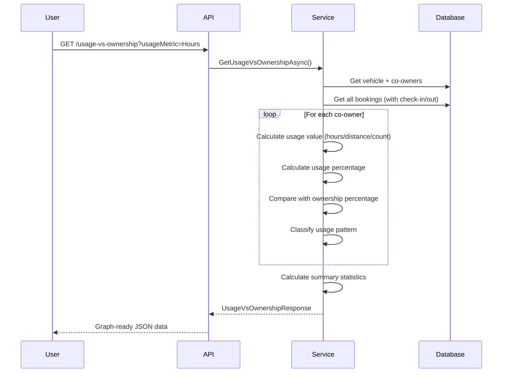

# 📊 Usage vs Ownership Analytics Feature Documentation

## Overview

The **Usage vs Ownership Analytics** feature provides comprehensive data visualization and comparison tools to analyze how actual vehicle usage compares to ownership percentages among co-owners. This helps identify usage patterns, ensure fair usage distribution, and facilitate data-driven decisions about cost allocation and ownership adjustments.

## 🎯 Key Features

1. **Usage vs Ownership Comparison** - Compare actual usage with ownership percentages
2. **Multiple Usage Metrics** - Track usage by hours, distance (km), or booking count
3. **Usage Pattern Classification** - Identify balanced, overutilized, and underutilized co-owners
4. **Time-Series Trends** - View usage evolution over time (daily, weekly, monthly)
5. **Detailed Co-Owner Analytics** - Comprehensive usage breakdown per co-owner
6. **Statistical Summaries** - Variance analysis, most/least active co-owners, totals

## 📊 Usage Metrics

### 1. **Hours**
- **Calculation**: Sum of `(EndTime - StartTime)` for all bookings
- **Unit**: Hours (decimal)
- **Best for**: Time-based fair usage analysis
- **Example**: John used 222 hours (55.5%) vs 40% ownership = +15.5% overutilized

### 2. **Distance**
- **Calculation**: Sum of odometer differences (`CheckOut.OdometerReading - CheckIn.OdometerReading`)
- **Unit**: Kilometers
- **Best for**: Mileage-based cost sharing
- **Example**: Jane drove 1,500 km (52%) vs 60% ownership = -8% underutilized

### 3. **BookingCount**
- **Calculation**: Count of bookings
- **Unit**: Number of bookings
- **Best for**: Equal opportunity usage tracking
- **Example**: John made 15 bookings (60%) vs 40% ownership = +20% overutilized

## 🎨 Usage Patterns

The system automatically classifies each co-owner's usage pattern:

| Pattern | Condition | Description | Example |
|---------|-----------|-------------|---------|
| **Balanced** | `\|usageΔ\| ≤ 5%` | Usage matches ownership (±5% tolerance) | 42% usage vs 40% ownership = Balanced |
| **Overutilized** | `usageΔ > 5%` | Usage exceeds ownership by >5% | 60% usage vs 40% ownership = Overutilized (+20%) |
| **Underutilized** | `usageΔ < -5%` | Usage below ownership by >5% | 30% usage vs 50% ownership = Underutilized (-20%) |

**Formula**: `usageΔ = usagePercentage - ownershipPercentage`

## 🗂️ Architecture

### File Structure

```
EvCoOwnership.Repositories/
└── DTOs/
    └── UsageAnalyticsDTOs/
        └── UsageVsOwnershipDTOs.cs        # 10 DTOs + validator

EvCoOwnership.Services/
├── Interfaces/
│   └── IUsageAnalyticsService.cs          # 3 method signatures
└── Services/
    └── UsageAnalyticsService.cs           # ~600 lines implementation

EvCoOwnership.API/
└── Controllers/
    └── UsageAnalyticsController.cs        # 3 REST endpoints
```

### Data Flow



## 🌐 API Endpoints

### 1. Get Usage vs Ownership Comparison
```http
GET /api/usageanalytics/vehicle/{vehicleId}/usage-vs-ownership
```

**Query Parameters:**
- `startDate` (optional): Analysis start date (ISO 8601, defaults to vehicle creation)
- `endDate` (optional): Analysis end date (ISO 8601, defaults to current date)
- `usageMetric` (optional): `Hours` (default), `Distance`, or `BookingCount`

**Response Example:**
```json
{
  "statusCode": 200,
  "message": "USAGE_VS_OWNERSHIP_DATA_RETRIEVED_SUCCESSFULLY",
  "data": {
    "vehicleId": 1,
    "vehicleName": "Tesla Model 3",
    "licensePlate": "30A-12345",
    "analysisStartDate": "2024-01-01T00:00:00Z",
    "analysisEndDate": "2024-10-23T00:00:00Z",
    "usageMetric": "Hours",
    "coOwnersData": [
      {
        "coOwnerId": 1,
        "userId": 5,
        "coOwnerName": "John Doe",
        "email": "john@example.com",
        "ownershipPercentage": 40.00,
        "investmentAmount": 400000000.00,
        "usagePercentage": 55.50,
        "actualUsageValue": 222.0,
        "totalBookings": 15,
        "completedBookings": 13,
        "usageVsOwnershipDelta": 15.50,
        "usagePattern": "Overutilized",
        "fairUsageValue": 160.0
      },
      {
        "coOwnerId": 2,
        "userId": 6,
        "coOwnerName": "Jane Smith",
        "email": "jane@example.com",
        "ownershipPercentage": 60.00,
        "investmentAmount": 600000000.00,
        "usagePercentage": 44.50,
        "actualUsageValue": 178.0,
        "totalBookings": 10,
        "completedBookings": 9,
        "usageVsOwnershipDelta": -15.50,
        "usagePattern": "Underutilized",
        "fairUsageValue": 240.0
      }
    ],
    "summary": {
      "totalUsageValue": 400.0,
      "averageOwnershipPercentage": 50.00,
      "averageUsagePercentage": 50.00,
      "usageVariance": 15.50,
      "totalBookings": 25,
      "completedBookings": 22,
      "mostActiveCoOwner": {
        "coOwnerId": 1,
        "coOwnerName": "John Doe",
        "usagePercentage": 55.50
      },
      "leastActiveCoOwner": {
        "coOwnerId": 2,
        "coOwnerName": "Jane Smith",
        "usagePercentage": 44.50
      },
      "balancedCoOwnersCount": 0,
      "overutilizedCoOwnersCount": 1,
      "underutilizedCoOwnersCount": 1
    },
    "generatedAt": "2024-10-23T10:30:00Z"
  }
}
```

### 2. Get Usage vs Ownership Trends
```http
GET /api/usageanalytics/vehicle/{vehicleId}/usage-vs-ownership/trends
```

**Query Parameters:**
- `startDate` (optional): Analysis start date
- `endDate` (optional): Analysis end date
- `granularity` (optional): `Daily`, `Weekly`, or `Monthly` (default)

**Response Example:**
```json
{
  "statusCode": 200,
  "message": "USAGE_VS_OWNERSHIP_TRENDS_RETRIEVED_SUCCESSFULLY",
  "data": {
    "vehicleId": 1,
    "vehicleName": "Tesla Model 3",
    "licensePlate": "30A-12345",
    "analysisStartDate": "2024-01-01T00:00:00Z",
    "analysisEndDate": "2024-10-23T00:00:00Z",
    "granularity": "Monthly",
    "trendData": [
      {
        "date": "2024-01-01T00:00:00Z",
        "period": "Jan 2024",
        "coOwnersData": [
          {
            "coOwnerId": 1,
            "coOwnerName": "John Doe",
            "ownershipPercentage": 40.00,
            "usagePercentage": 60.00,
            "usageValue": 48.0
          },
          {
            "coOwnerId": 2,
            "coOwnerName": "Jane Smith",
            "ownershipPercentage": 60.00,
            "usagePercentage": 40.00,
            "usageValue": 32.0
          }
        ]
      },
      {
        "date": "2024-02-01T00:00:00Z",
        "period": "Feb 2024",
        "coOwnersData": [...]
      }
    ],
    "generatedAt": "2024-10-23T10:30:00Z"
  }
}
```

### 3. Get Co-Owner Usage Detail
```http
GET /api/usageanalytics/vehicle/{vehicleId}/co-owner/{coOwnerId}/usage-detail
```

**Query Parameters:**
- `startDate` (optional): Analysis start date
- `endDate` (optional): Analysis end date

**Response Example:**
```json
{
  "statusCode": 200,
  "message": "CO_OWNER_USAGE_DETAIL_RETRIEVED_SUCCESSFULLY",
  "data": {
    "coOwnerId": 1,
    "userId": 5,
    "coOwnerName": "John Doe",
    "email": "john@example.com",
    "vehicleId": 1,
    "vehicleName": "Tesla Model 3",
    "ownershipPercentage": 40.00,
    "usagePercentage": 55.50,
    "usageVsOwnershipDelta": 15.50,
    "usageMetrics": {
      "totalHours": 222.0,
      "hoursPercentage": 55.50,
      "totalDistance": 1500.0,
      "distancePercentage": 52.00,
      "totalBookings": 15,
      "bookingsPercentage": 60.00,
      "completedBookings": 13,
      "cancelledBookings": 2,
      "averageBookingDuration": 14.80
    },
    "recentBookings": [
      {
        "bookingId": 45,
        "startTime": "2024-10-20T08:00:00Z",
        "endTime": "2024-10-20T18:00:00Z",
        "durationHours": 10.0,
        "distanceTravelled": 120,
        "status": "Completed",
        "purpose": "Business trip"
      }
    ],
    "analysisStartDate": "2024-01-01T00:00:00Z",
    "analysisEndDate": "2024-10-23T00:00:00Z",
    "generatedAt": "2024-10-23T10:30:00Z"
  }
}
```

## 📊 DTOs Overview

### UsageVsOwnershipResponse
Main response containing comparison data for all co-owners.
- **Fields**: vehicleId, vehicleName, dates, usageMetric, coOwnersData[], summary
- **Use case**: Main graph data source

### CoOwnerUsageVsOwnership
Individual co-owner usage vs ownership data.
- **Fields**: ownership%, usage%, delta, pattern, actualValue, fairValue, bookings
- **Use case**: Bar chart, pie chart data points

### UsageOwnershipSummary
Aggregate statistics for the vehicle.
- **Fields**: totals, averages, variance, most/least active, pattern counts
- **Use case**: Dashboard KPIs, summary cards

### UsageVsOwnershipTrendsResponse
Time-series data for trend visualization.
- **Fields**: vehicleId, granularity, trendData[]
- **Use case**: Line charts, area charts over time

### TrendDataPoint
Single time point in trend data.
- **Fields**: date, period label, coOwnersData[]
- **Use case**: X-axis points in timeline charts

### CoOwnerUsageDetailResponse
Comprehensive breakdown for one co-owner.
- **Fields**: ownership, usage, all metrics (hours/distance/bookings), recent bookings
- **Use case**: Detailed co-owner profile page

### UsageMetricsBreakdown
Multi-metric analysis for a co-owner.
- **Fields**: hours, distance, bookings (all with percentages)
- **Use case**: Multi-dimensional analysis

### BookingUsageSummary
Booking details for usage analysis.
- **Fields**: id, dates, duration, distance, status, purpose
- **Use case**: Booking history table

## 🔍 Use Cases

### 1. Fair Usage Dashboard
**Scenario**: Display usage vs ownership graph on vehicle dashboard

```javascript
// Frontend: Fetch graph data
GET /api/usageanalytics/vehicle/1/usage-vs-ownership?usageMetric=Hours

// Display bar chart comparing ownership% vs usage%
Chart.js config:
- X-axis: Co-owner names
- Y-axis: Percentage (0-100%)
- Bars: [Ownership%, Usage%]
- Colors: Green (balanced), Orange (overutilized), Blue (underutilized)
```

### 2. Usage Trends Over Time
**Scenario**: Show how usage patterns evolved month-by-month

```javascript
GET /api/usageanalytics/vehicle/1/usage-vs-ownership/trends?granularity=Monthly

// Display line chart
- X-axis: Months (Jan 2024, Feb 2024, ...)
- Y-axis: Usage %
- Lines: One per co-owner
- Reference line: Ownership % (dotted)
```

### 3. Co-Owner Usage Profile
**Scenario**: Detailed usage breakdown for a specific co-owner

```javascript
GET /api/usageanalytics/vehicle/1/co-owner/1/usage-detail

// Display:
- Summary card: Ownership 40%, Usage 55.5%, Delta +15.5% (Overutilized)
- Multi-metric chart: Hours 55.5%, Distance 52%, Bookings 60%
- Recent bookings table with distance and duration
```

### 4. Identify Imbalanced Usage
**Scenario**: Find co-owners with significant usage imbalance

```javascript
GET /api/usageanalytics/vehicle/1/usage-vs-ownership

// Filter response.data.coOwnersData where:
- usagePattern === "Overutilized" || usagePattern === "Underutilized"
- Display alerts/notifications to co-owners
```

### 5. Cost Allocation Report
**Scenario**: Calculate maintenance costs based on actual usage

```javascript
GET /api/usageanalytics/vehicle/1/usage-vs-ownership?usageMetric=Distance

// Calculate cost per km: totalMaintenanceCost / summary.totalUsageValue
// Each co-owner pays: costPerKm × actualUsageValue
```

### 6. Compare Metrics
**Scenario**: Compare usage by hours vs distance vs bookings

```javascript
// Fetch data with different metrics
const byHours = await GET(...?usageMetric=Hours)
const byDistance = await GET(...?usageMetric=Distance)
const byBookings = await GET(...?usageMetric=BookingCount)

// Display side-by-side comparison
```

## 🔐 Authorization

All endpoints require:
- **Authentication**: Bearer JWT token
- **Role**: CoOwner
- **Ownership Verification**: User must be a co-owner of the vehicle

**Error Responses:**
- `403 NOT_AUTHORIZED_TO_VIEW_VEHICLE_ANALYTICS` - User is not a co-owner
- `404 VEHICLE_NOT_FOUND` - Vehicle doesn't exist
- `404 CO_OWNER_NOT_FOUND` - Co-owner doesn't exist

## 🧮 Calculation Logic

### Usage Percentage Calculation
```csharp
// For each co-owner:
actualUsageValue = CalculateUsageValue(bookings, metric)

// After calculating all co-owners:
totalUsageValue = Sum(allCoOwners.actualUsageValue)
usagePercentage = (actualUsageValue / totalUsageValue) × 100

// Delta:
usageVsOwnershipDelta = usagePercentage - ownershipPercentage
```

### Fair Usage Value
```csharp
// Expected usage based on ownership
fairUsageValue = totalUsageValue × (ownershipPercentage / 100)

// Example:
// Total hours: 400
// John's ownership: 40%
// John's fair usage: 400 × 0.40 = 160 hours
// John's actual usage: 222 hours
// Difference: +62 hours overutilized
```

### Distance Calculation
```csharp
// From check-in and check-out odometer readings
distance = checkOut.OdometerReading - checkIn.OdometerReading

// If odometer readings missing: distance = null (not counted)
```

### Variance Calculation
```csharp
// Standard deviation of usage vs ownership deltas
mean = Average(allDeltas)
sumOfSquares = Sum((delta - mean)²)
variance = √(sumOfSquares / count)

// Lower variance = more balanced usage
// Higher variance = more imbalanced usage
```

## 📈 Frontend Integration Guide

### Chart.js Bar Chart Example
```javascript
const response = await fetch('/api/usageanalytics/vehicle/1/usage-vs-ownership');
const { data } = await response.json();

new Chart(ctx, {
  type: 'bar',
  data: {
    labels: data.coOwnersData.map(c => c.coOwnerName),
    datasets: [
      {
        label: 'Ownership %',
        data: data.coOwnersData.map(c => c.ownershipPercentage),
        backgroundColor: '#3498db'
      },
      {
        label: 'Usage %',
        data: data.coOwnersData.map(c => c.usagePercentage),
        backgroundColor: data.coOwnersData.map(c => 
          c.usagePattern === 'Balanced' ? '#2ecc71' :
          c.usagePattern === 'Overutilized' ? '#e74c3c' : '#f39c12'
        )
      }
    ]
  },
  options: {
    scales: { y: { beginAtZero: true, max: 100 } },
    plugins: {
      title: { display: true, text: `Usage vs Ownership (${data.usageMetric})` }
    }
  }
});
```

### React Component Example
```jsx
function UsageVsOwnershipChart({ vehicleId }) {
  const [data, setData] = useState(null);
  const [metric, setMetric] = useState('Hours');

  useEffect(() => {
    fetch(`/api/usageanalytics/vehicle/${vehicleId}/usage-vs-ownership?usageMetric=${metric}`)
      .then(res => res.json())
      .then(response => setData(response.data));
  }, [vehicleId, metric]);

  if (!data) return <Loading />;

  return (
    <div>
      <select value={metric} onChange={e => setMetric(e.target.value)}>
        <option value="Hours">By Hours</option>
        <option value="Distance">By Distance (km)</option>
        <option value="BookingCount">By Bookings</option>
      </select>
      
      <ChartComponent data={data} />
      
      <SummaryCards>
        <Card title="Total Usage" value={data.summary.totalUsageValue} />
        <Card title="Balanced" value={data.summary.balancedCoOwnersCount} />
        <Card title="Overutilized" value={data.summary.overutilizedCoOwnersCount} />
        <Card title="Underutilized" value={data.summary.underutilizedCoOwnersCount} />
      </SummaryCards>
    </div>
  );
}
```

## 🧪 Testing Scenarios

### Test 1: Balanced Usage
```
Setup:
- 2 co-owners: A (50%), B (50%)
- Total hours: 100
- A uses 50 hours (50%), B uses 50 hours (50%)

Expected:
- Both classified as "Balanced"
- usageVsOwnershipDelta = 0 for both
- usageVariance ≈ 0
```

### Test 2: Overutilized Scenario
```
Setup:
- 2 co-owners: A (30%), B (70%)
- Total hours: 100
- A uses 60 hours (60%), B uses 40 hours (40%)

Expected:
- A: "Overutilized" (+30%)
- B: "Underutilized" (-30%)
- fairUsageValue: A=30, B=70
```

### Test 3: Distance Metric
```
Setup:
- Bookings with check-in/out odometer readings
- CheckIn: 1000 km, CheckOut: 1150 km
- Distance: 150 km

Expected:
- actualUsageValue includes 150 km
- Distance percentage calculated correctly
```

### Test 4: Trends Over Time
```
Setup:
- 6 months of bookings
- Granularity: Monthly
- Usage patterns change each month

Expected:
- 6 TrendDataPoint objects
- Each with correct period label ("Jan 2024", etc.)
- Usage percentages vary by month
```

## 📊 Performance Considerations

### Query Optimization
- **Eager Loading**: Uses `Include()` for bookings, check-ins, check-outs
- **Date Filtering**: Indexed on `Booking.StartTime`
- **Pagination**: Not needed (limited by vehicle co-owners count)

### Caching Strategy
```csharp
// Recommended: Cache for 5-10 minutes
[ResponseCache(Duration = 300)] // 5 minutes
public async Task<IActionResult> GetUsageVsOwnership(...)
```

### Large Datasets
- If vehicle has >1000 bookings, consider limiting date range
- Trends endpoint: More expensive, cache longer (15-30 min)

## 🚀 Future Enhancements

1. **Predictive Analytics** - Predict future usage patterns based on historical data
2. **Cost Allocation Calculator** - Auto-calculate maintenance costs per co-owner
3. **Alerts & Notifications** - Notify when usage becomes heavily imbalanced
4. **Usage Quotas** - Set usage limits based on ownership percentage
5. **Export to Excel/PDF** - Generate usage reports
6. **Comparison Mode** - Compare multiple time periods side-by-side
7. **Custom Metrics** - Allow custom usage calculation formulas
8. **Usage Targets** - Set goals for balanced usage and track progress

## ✅ Best Practices

1. **Use Hours for Default** - Most intuitive and accurate for time-based systems
2. **Include Odometer Readings** - Essential for distance-based analysis
3. **Set Tolerance Threshold** - 5% tolerance is reasonable for "balanced" classification
4. **Regular Monitoring** - Check usage patterns monthly
5. **Transparent Communication** - Share usage data with all co-owners
6. **Fair Cost Allocation** - Use distance metric for maintenance costs
7. **Cache Appropriately** - 5-10 min for usage data, 15-30 min for trends

## 📚 Related Documentation

- [OWNERSHIP_CHANGE_FEATURE.md](./OWNERSHIP_CHANGE_FEATURE.md) - Ownership adjustments
- [OWNERSHIP_HISTORY_FEATURE.md](./OWNERSHIP_HISTORY_FEATURE.md) - Ownership history
- [README_coding_conventions.md](./EvCoOwnership.API/README_coding_conventions.md) - Coding standards

---

**Created**: October 23, 2024  
**Last Updated**: October 23, 2024  
**Version**: 1.0.0  
**Status**: ✅ Production Ready
